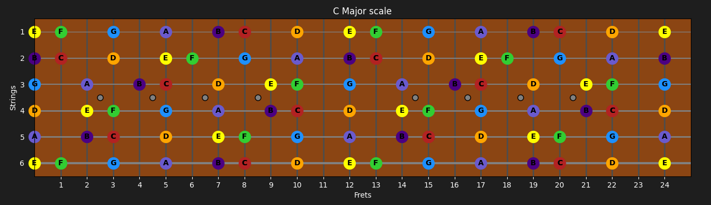
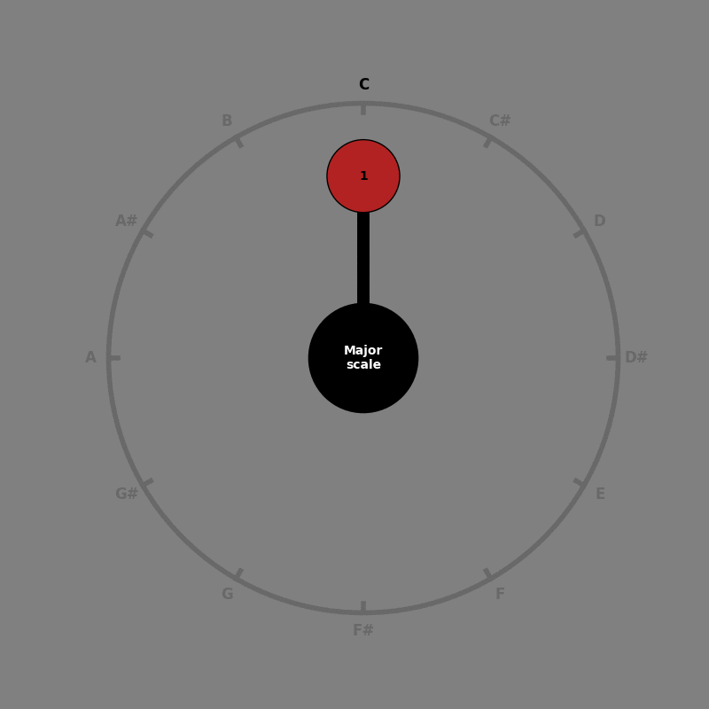

# About this repository
This repository currently has the following scripts:

#### 1. guitar.py
A script to plot a guitar fretboard showing notes, chords and scales on the strings.

Example output:
```bash
python guitar.py --scale Major --root C
```
<p align="center">
  
</p>

#### 2. music_theory_lab.py
A script to experiment around with music theory concepts while playing actual sounds.
If used in the graphical mode, it visualizes chords and scales on a "chromatic clock" showing interval names and optionally specific note names.

Example output (graphical mode):
```bash
python music_theory_lab.py --root C --scale Major --graphics --animate
```
<p align="center">
  
</p>

## :hammer_and_wrench: Setup/ Preparation
- if you don't have pipenv installed, install it as following then make sure to add it to PATH.
```bash
pip3 install pipenv
```
- Install required backends for audio and graphics
```bash
sudo apt-get install timidity
sudo apt-get install python3.10-tk
```
- Setup the pipenv
```bash
pipenv install --ignore-pipfile --skip-lock --python 3.10
pipenv shell
```
If faced by "fluidsynth file not found" on some linux environment, try the following.
```bash
sudo apt-get install fluid-soundfont-gm
```

## :rocket: Usage examples: music_theory_lab.py
##### :sparkles: Use the `--graphics` option for a graphical visualization instead of text. Use `--animate` to make notes appear one by one.
##### :sparkles: Not using the `--midi` option will playback sounds using pygame.sndarray. The graphical mode has the --midi option enabled by default.
#### :musical_note: Play a simple note
Example: C at 4th octave
```bash
python music_theory_lab.py --note C --octave 4 --midi
```
#### :musical_keyboard: Play a specific scale with a specific root note
Example: C Major scale at 4th octave
```bash
python music_theory_lab.py --root C --scale Major --octave 4 --midi
```
Example: E Phrygian mode of the Major scale
```bash
python music_theory_lab.py --root E --scale Major --mode Phrygian --midi
```
Example: Graphical mode C Major scale at 4th octave
```bash
python music_theory_lab.py --root C --scale Major --octave 4 --graphics
```
#### :notes: Play a specific chord with a specific root note
Example: C Major chord at 4th octave
```bash
python music_theory_lab.py --root C --chord Major_triad --octave 4 --midi
```
#### :notes::notes: Play a chord progression in a specific key
Example: Play I IV I V (1 4 1 5) chord progression in the key of C Major (add a small 'm' for minor keys)
```bash
python music_theory_lab.py --progression 1 4 1 5 --key C --midi
```
#### :mortar_board: Tutorial mode (sensei mode)
If you want to grasp music theory concepts in less than 5 minutes, then this command is for you.
```bash
python music_theory_lab.py --tutorial
```
:information_source: Check the help output (-h option) for a full list of options, flags and setting values.
```bash
python music_theory_lab.py --help
```
## :rocket: Usage examples: guitar.py

#### :musical_score: Show all the note names on the fret board
```bash
python guitar.py --all
```
#### :musical_keyboard: Show all the note positions for the C Major scale on the fret board
```bash
python guitar.py --scale Major --root C
```
#### :notes: Show all the note positions for the C Major chord on the fret board
```bash
python guitar.py --chord Major_triad --root C
```
#### :notes: Show all locations of a specific note on the fret board
```bash
python guitar.py --note C
```
